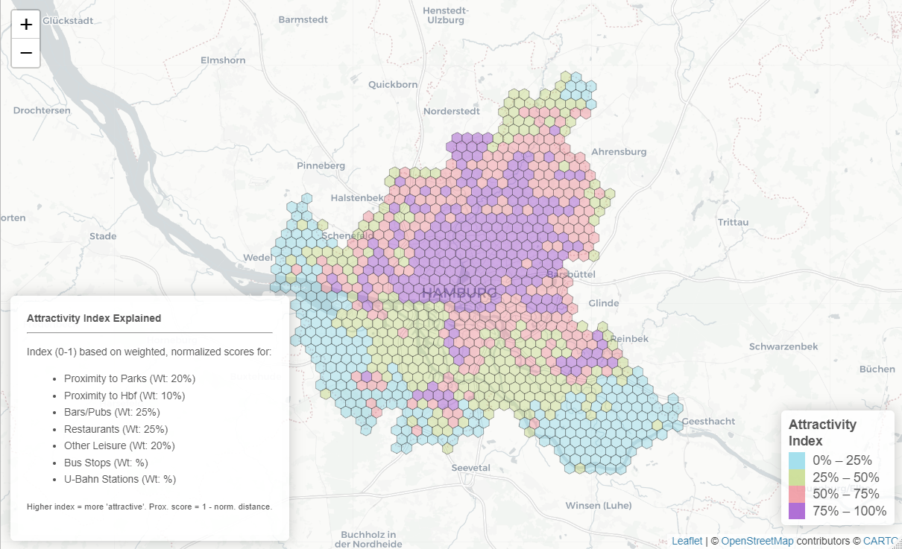

# Hamburg Hexagon Attractivity Analysis

## Description

This R project analyzes urban attractivity across a specified area of Hamburg, Germany, using a hexagonal grid overlay. It leverages live data from OpenStreetMap (OSM) via the `osmdata` package to calculate various metrics for each hexagon, including:

-   Proximity to parks and the main train station (Hauptbahnhof).
-   Counts of amenities like bars, restaurants, other leisure locations, bus stops, and U-Bahn (subway) stations.

Based on these metrics, it computes a customizable "Attractivity Index" and visualizes this index on an interactive Leaflet map, allowing for exploration of spatial patterns within the city. The analysis area is defined by a bounding box focused on the main city area, excluding the geographically distant island of Neuwerk.

## Features

-   Generates a hexagonal grid over a defined Hamburg bounding box.
-   Queries live OpenStreetMap data for various Points of Interest (POIs) and infrastructure:
    -   Parks & Green Spaces
    -   Hamburg Hauptbahnhof
    -   Bars/Pubs
    -   Restaurants
    -   Other Leisure Amenities
    -   Bus Stops
    -   U-Bahn (Subway) Stations
-   Calculates proximity metrics (distance to nearest park, distance to Hbf).
-   Calculates density metrics (counts of POIs/stations per hexagon).
-   Computes a weighted, normalized "Attractivity Index" based on the calculated metrics.
-   Visualizes the Attractivity Index on an interactive Leaflet map.
-   Uses a custom Neo-Brutalist inspired color palette for the map.
-   Provides detailed tooltips for each hexagon showing the index and component metric values.
-   Includes an on-map explanation of the index components and weighting.
-   (Optional) Includes a helper function (`save_sf_objects_to_rds`) to save generated spatial data frames (`sf` objects ending in `_sf`) to individual `.rds` files.

## Example Output

 *Visualization showing the Attractivity Index across Hamburg hexagons.*

## Requirements

-   **R:** Version 4.0.0 or higher recommended.
-   **RStudio:** Recommended IDE for running the script and viewing plots/maps.
-   **R Packages:** See Installation section.

## Installation

1.  **Clone the repository:** `bash     git clone https://github.com/lrodeck/German-Traffic-Strength     cd <repository-directory>`
2.  **Open the R script** (e.g., `hamburg_hex_analysis.R`) in RStudio.
3.  **Install required R packages:** Run the following command in the R console: `R     install.packages(c("sf", "osmdata", "dplyr", "leaflet", "units", "lwgeom", "tidyr", "htmltools"))` *(Note: `tidyverse` was loaded in the script but only `dplyr` and `tidyr` components seemed essential based on the final script. If you use other `tidyverse` functions, add `tidyverse` to the install list).*

## Usage

1.  **Set Working Directory:** Ensure your R session's working directory is set to the location of the script, or open the script within an RStudio Project based in the repository folder.
2.  **Review Parameters (Optional):**
    -   In Section 2, you can adjust:
        -   `aoi_bbox`: The bounding box defining the analysis area.
        -   `target_crs`: The projected Coordinate Reference System (defaults to UTM 32N for Hamburg).
        -   `hex_cellsize_m`: The approximate size of the hexagons in meters.
3.  **Review Index Weights (Optional):**
    -   In Section 6e, modify the `weights` list to change the relative importance of different factors in the Attractivity Index. **Ensure weights sum to 1.0**.
4.  **Review Color Palette (Optional):**
    -   In Section 7, you can change the `neo_brutalist_colors` vector and `n_color_bins` variable to customize the map's appearance.
5.  **Run the Script:** Execute the entire R script (e.g., using `source("your_script_name.R")` or clicking "Source" in RStudio).
6.  **View Output:**
    -   The script will print progress messages to the console.
    -   An interactive Leaflet map showing the Attractivity Index will be displayed in the RStudio Viewer pane or your default web browser. Hover over hexagons for labels and click for detailed popups.
7.  **Save Results (Optional):**
    -   If you included the `save_sf_objects_to_rds` function, run `save_sf_objects_to_rds()` after the main script finishes to save relevant `sf` objects (like `hex_grid_hamburg` if renamed or adapted) to `.rds` files in the working directory.

## Data Source

-   All spatial data is sourced live from **OpenStreetMap (OSM)** using the [`osmdata`](https://cran.r-project.org/package=osmdata) R package.
-   Data accuracy and completeness are dependent on OSM contributions for the Hamburg area.
-   Running the script executes live queries against OSM APIs (typically Overpass API). Please be mindful of API usage limits. Queries for a large area and multiple features can take several minutes and may download a significant amount of data.

## Attractivity Index Calculation

The attractivity index calculated in Section 6e provides a relative measure of attractiveness for each hexagon based on the specified components. The calculation involves:

1.  **Normalization:** Each component metric (counts and distances) is scaled to a 0-1 range using min-max normalization.
2.  **Inversion:** Scores for distance metrics (parks, Hbf) are inverted (1 - normalized score) so that higher scores correspond to closer proximity.
3.  **Weighting:** Each normalized score is multiplied by its assigned weight (defined in the `weights` list in Section 6e). The *current* weights are displayed in the explanation box on the map.
4.  **Summation:** The weighted scores are summed to produce the final index value for each hexagon (ranging approximately from 0 to 1).

**Note:** This index is subjective and depends heavily on the chosen components and their assigned weights. Modify the `weights` list in the script to reflect different priorities.

## Customization

Users are encouraged to modify the script for their own analyses:

-   Adjust the `aoi_bbox`, `hex_cellsize_m`, or `target_crs`.
-   Change the components included in the **Attractivity Index** and their `weights`.
-   Customize the **map appearance** by changing `neo_brutalist_colors`, `n_color_bins`, or using different `color*` functions (e.g., `colorNumeric`).
-   Modify the **OSM queries** in Section 4 to include different features or use different tags.
